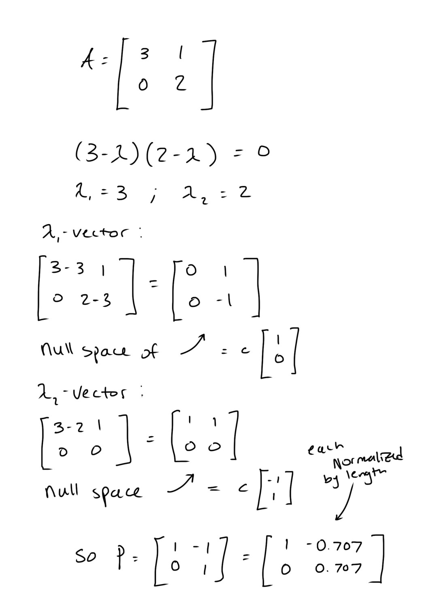

# Eigen Stuff & PCA

In this post, I will briefly try to explain the fundamental concepts of eigenvectors, eigenvalues, and eigenbasis. I'd first like to mention candidly that these names always intimidated me. Anything starting with the prefix "eigen" warrants some respect and wariness. While it is still an active area of development for me, I do understand them much, much better. For a lot of these posts, I would like to highly recommend and praise the MIT 18.06 Linear Algebra course freely available on YouTube. I never took Linear Algebra in college (it still baffles me that an engineering discipline (Petroleum Engineering) decided to leave out such an important course), and this course has been extremely helpful. The link is in the sources at the end of this article. I also recommend the 3Blue1Brown Essence of linear algebra series.

Lastly, I did use Claude for understanding these concepts and creating the artifact you see in the video header. It is super cool, and you can access it freely here:

[Claude Artifact](https://claude.ai/artifact/6hChnGHJfzyoeXNRyJYues)

## Review / background
The columns of a linear transformation (aka a matrix) can be interpreted as what happens to the x, y, z vectors of our normal perpendicular unit vectors (in 3x3 matrices).
A vector is defined by a magnitude (length) and direction.
So, Ax can be seen as x being rotated, sheared, stretched, squished, and/or flipped when A transforms it.
Symmetric matrices have perpendicular eigenvectors and the covariance matrix is symmetric (lucky us :)).
A basis is a group of vectors that fully define a space. The x-y plane we are all intimately familiar with is a vector space defined by the [1,0] and [0,1] vectors. 

## Eigen _______
So what is an eigenvector? An eigenvector is simply a vector that does not change its span when multiplied by A. In other words, it stays on the same line, just bigger, smaller or flipped.

So what is an eigenvalue? An eigenvalue is the amount that A stretches or squishes the eigenvector (flips if the eigenvalue is negative).

Finally, what is an eigenbasis? An eigenbasis is a basis made of A's eigenvectors. Instead of [1,0] and [0,1], we can describe the plane using A's two eigenvectors. If we use the x-y plane (2-dimensional) as an example, the unit vector in the x direction and the unit vector in the y direction define the plane. However, given an A (linear transformation) we can also define the plane in terms of that pair of its eigenvectors.

The Claude artifact I linked helps to visualize the associated eigenvectors and values for various types of A's. I have an example below for the triangular example in the artifact. Briefly, the steps are: 

1. Using the characteristic equation det(A- λI) = 0 we find the eigenvalues (λ)
2. Plug each λ back into (A-λI)x = 0. This solution gives you the eigenvector
3. Normalize each eigenvector to have a length of 1

## Principal Component Analysis (PCA)
So, a very important thing that I have not mentioned is that this eigen analysis relies on the matrix A being square. However, in ML, there is often a pesky rectangular matrix X of dimension mxn. Luckily, XᵀX (the transpose of X times X) is symmetric. By first subtracting the mean of each column from X then dividing XᵀX by (m-1), we get the covariance matrix. The eigenvectors of this covariance matrix give us the principal components of X. In other words, this gives us the directions of maximum variability. This allows us to represent high dimensional data in fewer dimensions, which can reduce redundant information and allow us to visualize data in meaningful and interpretable ways.

PCA is a very nice way to tie in eigenvectors to ML. A very closely related decomposition is the Singular Value Decomposition (SVD), which I am still trying to understand more fully.

I hope you enjoyed this short article.

Sources:

Coursework in my Machine Learning class

MIT 18.06SC Linear Algebra, Fall 2011 YouTube

3Blue1Brown - Essence of linear algebra

Ananthaswamy, A. (2024). Why machines learn: The elegant math behind modern AI. Dutton.

Claude
