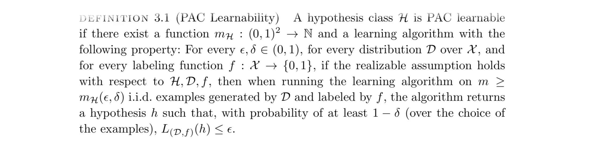
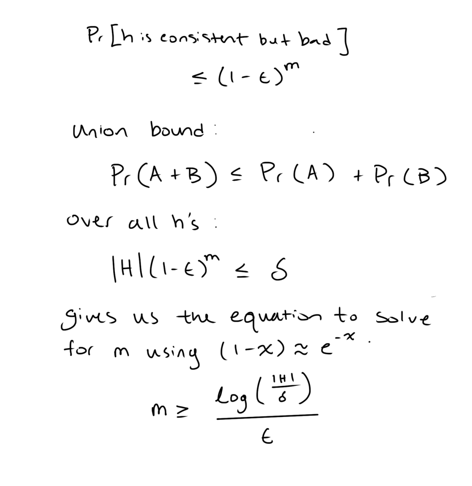

# PAC Learning

This week's post is going to be extra short, as I am prepping for the 1st exam in my Machine Learning class! One of the topics we will be tested on is an introductory level understanding of PAC Learning, which according the extremely helpful TA is not useful at all due to the assumptions and not used at all in practice. To me, the topic is a bit academic, and at this point, I can't see how it would really be more useful or practical than just understanding some basics and using random forests or even linear regression. That said, it is still a fun exercise to breakdown the intimidating notation for my own test prep and to show that it's not that hard to understand once you get past the jargon.

So, what is PAC even stand for. PAC stands for Probably Approximately Correct. Basically, it means a model/hypothesis/function that maps the input space (X) to the label space (Y) can be learned to achieve a chosen level of accuracy, with a chosen level of confidence, given a dataset of sufficient size.

Now let's breakdown the following passage (*Shalev-Shwartz & Ben-David, 2014*):

## In English (somewhat), please

A hypothesis class is a set of models that can describe the input data (fancy X above). So in set notation, the fancy H refers to the class of all possible hypotheses we could select/learn {h1, h2, ..., hn}. "is PAC learnable if ... :/ (fancy notation)" little m here is some function that maps 2 numbers between 0 and 1 to a natural number (i.e. counting numbers like 1, 2, 3, etc.). The output, N, is the sample size that guarantees we have a Probably (1-δ) Approximately Correct (ε) model. These two parameters, delta and epsilon, are chosen by us!

The fancy D is just the pool from which we draw a sample to train on, aka a true distribution from which we draw. The f is the true labeling function. f(x) -> {0,1} for binary classification and f(x) -> R (real number) for regression. Putting this all together, and applying the union bound over a finite hypothesis class H, gives us a bound on the sample size needed to learn a model that is Probably Approximately Correct. Below is the math that give the bound:

I hope someone stumbles across this post that is actually encountering PAC learning. High hopes I know. Otherwise, I hope you enjoyed my academic ramblings.

Sources:

Coursework in my Machine Learning class

Shalev-Shwartz, S., & Ben-David, S. (2014). Understanding machine learning: From theory to algorithms. Cambridge University Press. 

ChatGPT - for accuracy of material and grammar (never for writing - That's all me)
